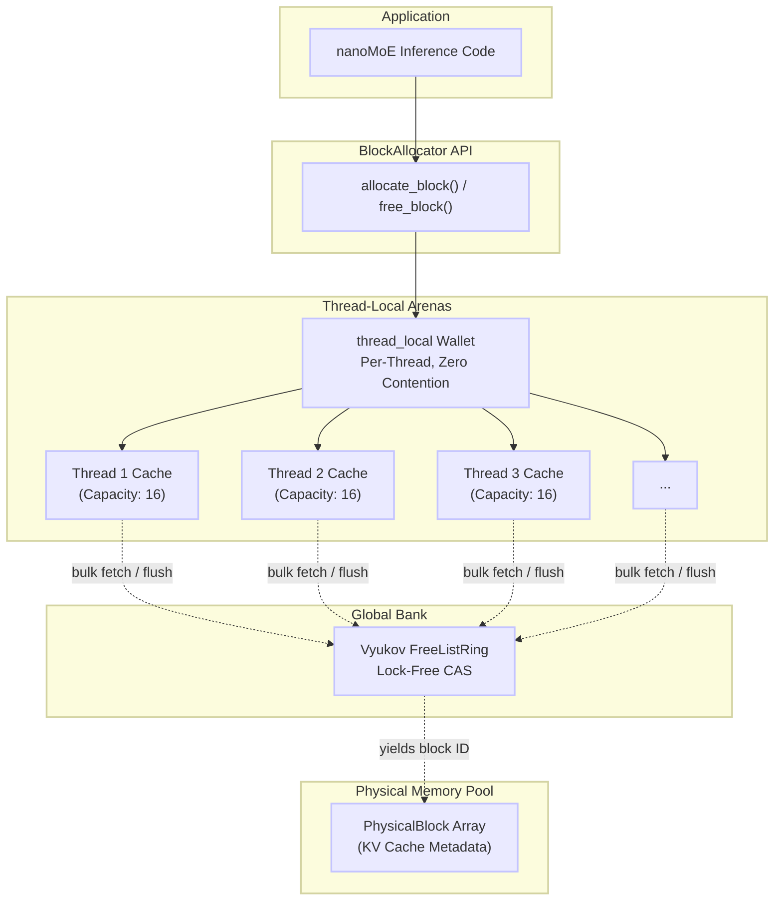
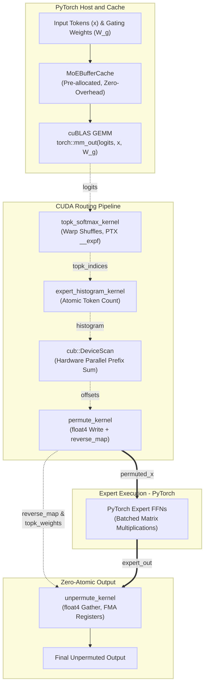

# nanoMoE

A high-performance CUDA MoE routing engine and lock-free C++ memory allocator designed for latency-sensitive LLM inference.

## Features

- **Lock-Free Memory Manager** - Uses atomic operations (CAS) and Vyukov MPMC ring buffer instead of mutexes for PagedAttention KV-cache management.
- **Thread-Local Arenas** - Zero-contention fast-path allocations via per-thread wallet caching.
- **Fused Top-K Routing** - Warp-parallel Top-K gating kernel with inline softmax normalization and PTX intrinsics.
- **Vectorized Scatter/Gather** - High-throughput `float4` CUDA kernels for token permutation, unpermutation, and KV-cache gathering.
- **PyTorch Integration** - Zero-copy PyTorch CUDA extensions (`custom_moe_cuda` & `custom_moe_legacy`) for seamless execution.
- **ThreadSanitizer-Verified** - Zero data races under concurrent multi-threaded alloc/free pressure.

---

## Quick Start

### Python Usage (MoE CUDA Extension)

```python
import torch
import custom_moe_cuda

# Input tokens: [batch_size * seq_len, hidden_dim]
x = torch.randn(128, 4096, device='cuda', dtype=torch.float32)
# Gating weights: [hidden_dim, num_experts]
gating_weights = torch.randn(4096, 8, device='cuda', dtype=torch.float32)

# Compute routing logits & perform Top-K routing (k=2)
logits = torch.matmul(x, gating_weights)
topk_weights, topk_indices = custom_moe_cuda.topk_softmax(logits, 2)
```

### C++ Usage (Lock-Free KV-Cache Allocator)

```cpp
#include "mem_manager.h"

int main() {
    // Initialize block allocator with 1024 physical blocks (block size 16)
    BlockAllocator allocator(1024, 16);

    // Allocate a KV-cache physical block
    uint32_t block_id = allocator.allocate_block();

    // Increment reference count for prefix-cache sharing
    allocator.add_ref(block_id);

    // Free block when ref_count reaches 0
    allocator.free_block(block_id);
}
```

---

## Building

```bash
# Install Python dependencies
pip install -r requirements.txt

# Build PyTorch CUDA extension
make build-ext
# or
pip install -e . --no-build-isolation

# Run C++ unit tests (no GPU required)
make test

# Run C++ ThreadSanitizer data-race check
make tsan

# Run CPU Memory Allocator benchmarks
make bench

# Run Python MoE correctness tests (GPU required)
python tests/python/test_moe.py
```

---

## Architecture

### Memory Allocator System



---

### CUDA MoE Routing Pipeline



---

### Component Overview

#### `src/` - Lock-Free Memory Manager

The KV-cache allocator (`BlockAllocator`) manages a pre-allocated pool of fixed-size `PhysicalBlock`s backed by a **Vyukov MPMC bounded ring buffer** - the same lock-free design used in LMAX Disruptor, Intel TBB, and Linux `io_uring`.

| Property | Value |
|---|---|
| **Allocation** | Lock-free `pop()` via `compare_exchange_weak` on ring head |
| **Deallocation** | Lock-free `push()` via `compare_exchange_weak` on ring tail |
| **ABA Hazard** | Structurally impossible - payload is `uint32_t` block ID, not a raw pointer |
| **Ref Count** | `std::atomic<int>` with `acq_rel` - safe for prefix-cache block sharing |
| **Cache Line Padding** | Head and tail padded to separate 64-byte cache lines to eliminate false sharing |

#### `csrc/moe.cu` - CUDA Kernels

| Kernel | Description |
|---|---|
| `fused_moe_router_kernel` | Warp-parallel top-k gating with softmax normalization and PTX `__expf` intrinsics |
| `expert_histogram_kernel` | `atomicAdd` histogram for expert token count computation |
| `exclusive_prefix_sum_kernel` / CUB Scan | Hardware-parallel prefix scan for expert scatter offsets |
| `permute_kernel` | Vectorized `float4` token scatter with COO index emission |
| `unpermute_kernel` | Weighted `atomicAdd` scatter back to original sequence order |
| `paged_memory_fetch_kernel` | Warp-coalesced `float4` KV-cache gather across fragmented physical blocks |

#### Memory Ordering Specification

| Operation | Order | Rationale |
|---|---|---|
| Ring `sequence` publish (push) | `release` | Ensures `block_id` write is visible to consuming thread |
| Ring `sequence` observe (pop) | `acquire` | Synchronizes with prior push release |
| Ring `sequence` recycle (pop) | `release` | Signals slot is writable to next producing thread |
| `ref_count` decrement | `acq_rel` | Acquires prior memory access; releases before block recycle |
| `ref_count` initialize | `release` | Publishes clean block state to concurrent decrementers |

---

## Makefile Reference

| Target | Description |
|---|---|
| `make test` | Compile and execute C++ allocator unit tests |
| `make tsan` | Build and run C++ tests under ThreadSanitizer |
| `make bench` | Build and run CPU allocator throughput/latency benchmarks |
| `make build-ext` | Build PyTorch CUDA C++ extension in-place |
| `make clean` | Clean up build artifacts and compiled objects |
